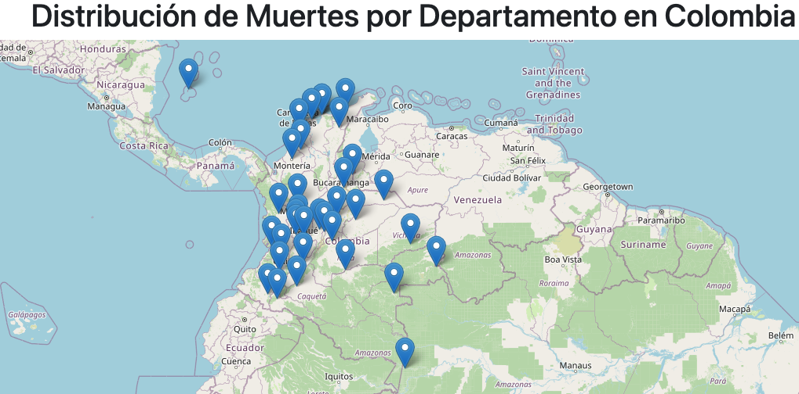
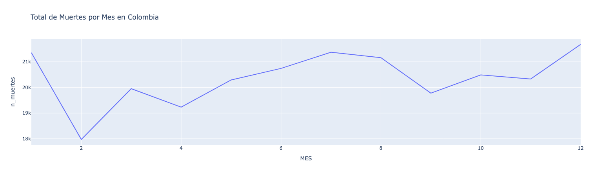
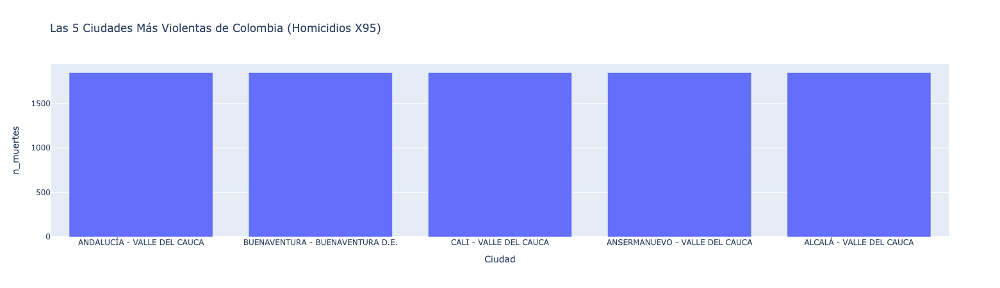
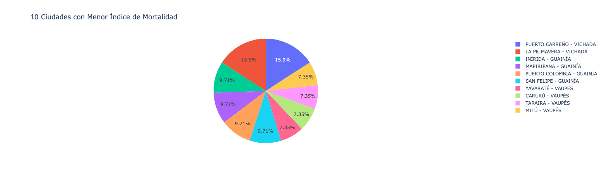
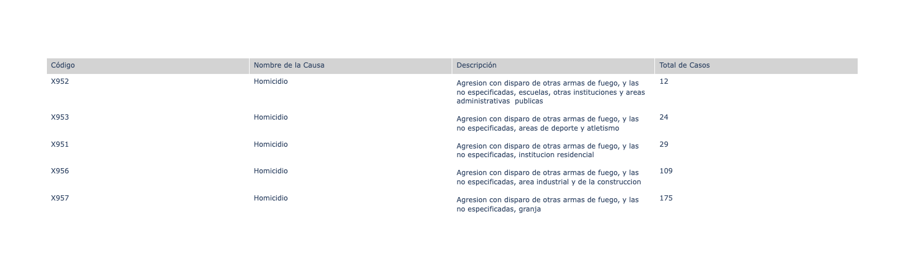
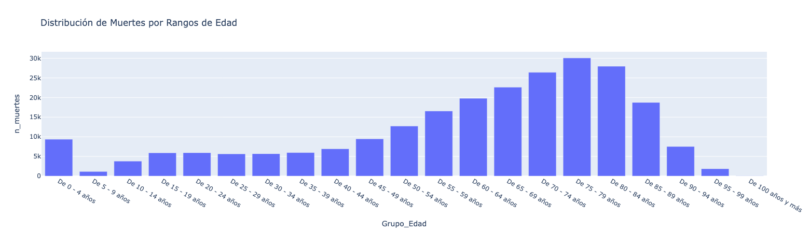
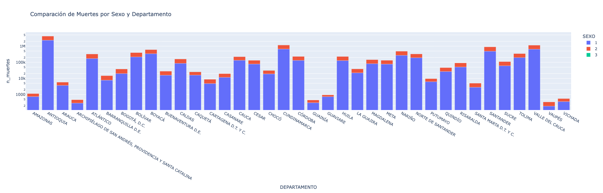

# Análisis de Datos por Reporte

En esta sección, se presenta un análisis detallado de los datos subyacentes a cada uno de los reportes generados, proporcionando una interpretación de los hallazgos y las principales observaciones.

## 1. Mapa de Distribución de Muertes por Departamento en Colombia

[Ver reporte interactivo](https://act4-unid2-app1-998899473084.us-central1.run.app/mapa)

* **Descripción del Reporte:** Este reporte muestra la distribución geográfica de la cantidad de muertes en los departamentos de Colombia.
* **Análisis:** El mapa proporciona una visión general de la distribución de las muertes a nivel departamental. Sin embargo, no permite identificar fácilmente el departamento con el mayor número de muertes. Se requiere información adicional o un reporte complementario (como el gráfico de barras apiladas descrito más adelante) para obtener una comprensión más clara de las disparidades entre departamentos.

## 2. Gráfico de Línea de Muertes No Fetales por Mes en Colombia en 2019

[Ver reporte interactivo](https://act4-unid2-app1-998899473084.us-central1.run.app/lineas)

* **Descripción del Reporte:** Este gráfico de línea ilustra la tendencia mensual de las muertes no fetales en Colombia durante el año 2019.
* **Análisis:** El gráfico revela una tendencia decreciente en el número de muertes durante el primer trimestre de 2019. Por el contrario, el tercer trimestre se destaca como el período más violento del año, con un aumento constante en el número de muertes. Diciembre se identifica como el mes con el mayor número de muertes en todo el año.

## 3. Gráfico de Barras con el Top 5 de Ciudades Más Violentas de Colombia

[Ver reporte interactivo](https://act4-unid2-app1-998899473084.us-central1.run.app/barras)

* **Descripción del Reporte:** Este gráfico de barras presenta las 5 ciudades con el mayor número de muertes en Colombia durante el año 2019.
* **Análisis:** El reporte muestra que las 5 ciudades con mayor número de muertes se encuentran ubicadas en el departamento del Valle del Cauca. Este hallazgo sugiere que el Valle del Cauca fue el departamento más afectado por la violencia en Colombia en 2019.

## 4. Gráfico Circular del Top 10 de Ciudades con Menos Muertes No Fetales en 2019

[Ver reporte interactivo](https://act4-unid2-app1-998899473084.us-central1.run.app/circular)

* **Descripción del Reporte:** Este gráfico circular muestra las 10 ciudades con el menor número de muertes no fetales en Colombia durante el año 2019.
* **Análisis:** El reporte revela que las 10 ciudades con menor número de muertes se encuentran ubicadas en la región amazónica de Colombia. Este hallazgo es consistente con la baja densidad poblacional de esta región. Sin embargo, el análisis advierte que el número absoluto de muertes puede no ser el indicador más adecuado para identificar las ciudades con menor incidencia de violencia. Se sugiere que un análisis del porcentaje de muertes ponderado por el número de habitantes proporcionaría una medida más precisa.  Además, se debe tener en cuenta que un top 10 de ciudades puede ser demasiada información para un gráfico circular, dificultando la distinción visual entre las porciones, especialmente cuando varios de los valores son muy cercanos.  Se recomienda considerar un top 5 o un gráfico de barras para una mejor visualización.

## 5. Tabla con las 10 Principales Causas de Muerte en Colombia en 2019

[Ver reporte interactivo](https://act4-unid2-app1-998899473084.us-central1.run.app/tabla)

* **Descripción del Reporte:** Esta tabla enumera las 10 principales causas de muerte en Colombia durante el año 2019.
* **Análisis:** La tabla muestra que la violencia es la principal causa de muerte en Colombia en 2019.

## 6. Histograma de Muertes por Edades

[Ver reporte interactivo](https://act4-unid2-app1-998899473084.us-central1.run.app/histograma)

* **Descripción del Reporte:** Este histograma muestra la distribución de las muertes por grupos de edad.
* **Análisis:** El histograma revela que la mayoría de las muertes ocurren en personas mayores de 60 años. Sin embargo, también se observa un pico preocupante en el número de muertes en niños de 0 a 4 años, que es más alto que el número de muertes en otros grupos de edad hasta los 45 años.

## 7. Gráfico de Barras Apiladas de Muertes por Departamento y Sexo

[Ver reporte interactivo](https://act4-unid2-app1-998899473084.us-central1.run.app/barras_apiladas)

* **Descripción del Reporte:** Este gráfico de barras apiladas complementa el mapa de distribución de muertes por departamento, proporcionando información adicional sobre la distribución de muertes por sexo dentro de cada departamento.
* **Análisis:** El gráfico de barras apiladas permite identificar el departamento con el mayor número de muertes. Además, cada barra muestra la distribución de las muertes por sexo. Sin embargo, la interpretación de esta distribución se ve limitada por la falta de información sobre la correspondencia entre las categorías de sexo (1, 2 y 3) y el sexo real de las personas fallecidas. Ni la fuente de datos original ni el DANE proporcionan esta información.
